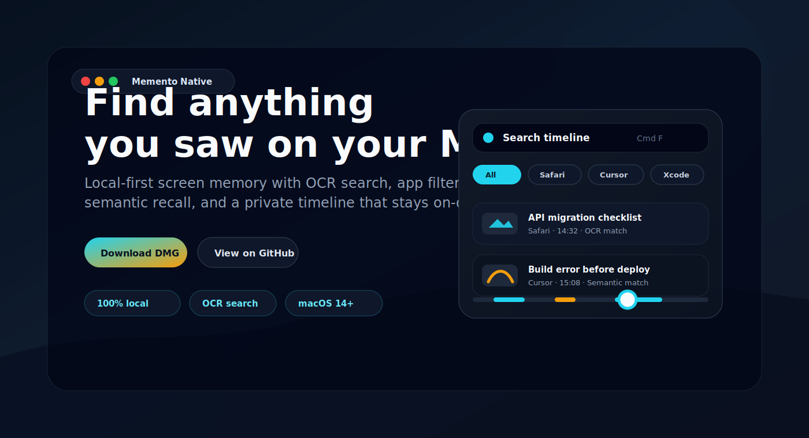
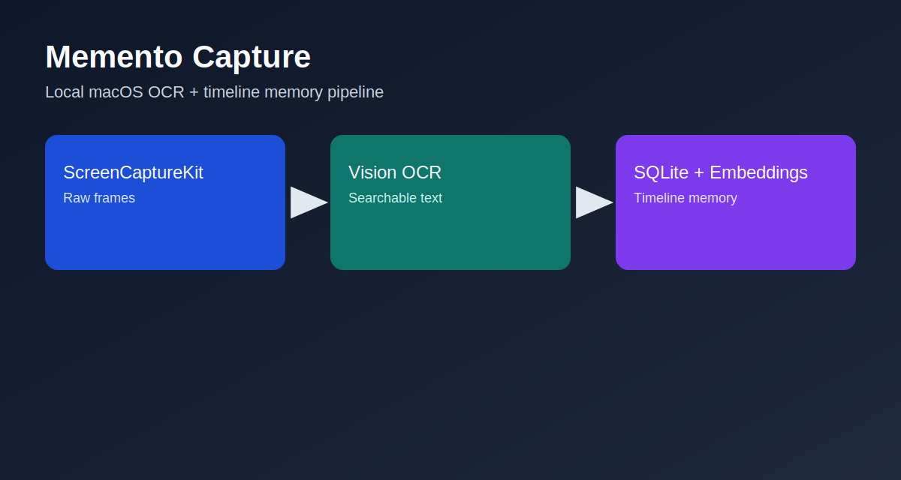
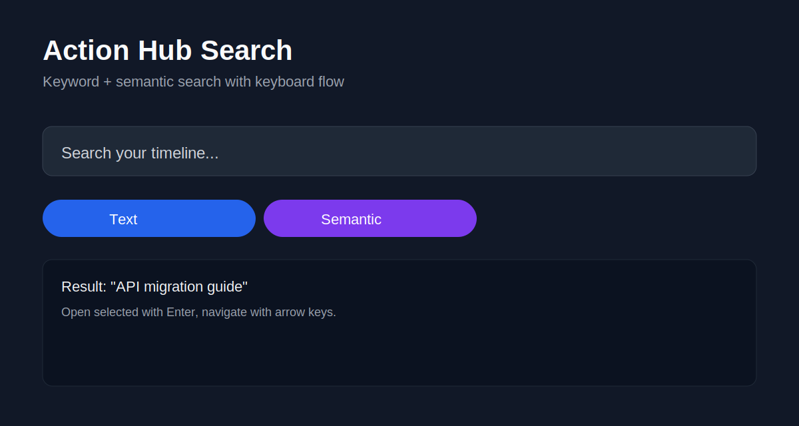
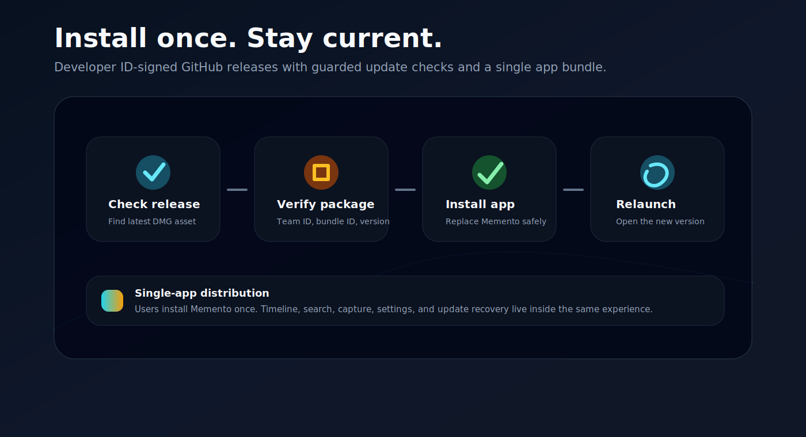

# Memento Native



**Find anything you saw on your Mac.**

Memento Native is a local-first macOS screen memory app for OCR search, semantic recall, and app-aware timeline browsing. It captures useful visual context in the background, lets you filter history by app or time, and keeps your archive on your Mac.

[Download latest DMG](https://github.com/owgit/memento-native/releases/latest) • [Read the FAQ](docs/FAQ.md) • [View changelog](CHANGELOG.md)

[](https://swift.org)
[](https://www.apple.com/macos)
[](LICENSE)
[](https://github.com/owgit/memento-native/releases)

> Native Swift rewrite of [apirrone/Memento](https://github.com/apirrone/Memento), rebuilt as a single Mac app with local storage, private capture controls, and direct GitHub releases.

Quick links: [FAQ](docs/FAQ.md) • [Settings Guide](docs/SETTINGS.md) • [Troubleshooting](docs/FAQ.md#troubleshooting--felsokning) • [Security](SECURITY.md) • [Contributing](CONTRIBUTING.md) • [Releases](https://github.com/owgit/memento-native/releases)

## Table of Contents

- [What Is Memento Native? / Vad Är Memento Native?](#what-is-memento-native--vad-ar-memento-native)
- [Who It's For / För Vem?](#who-its-for--for-vem)
- [Visual Overview](#visual-overview)
- [Latest (v2.1.3)](#latest-v213)
- [Install](#install)
- [Permissions and Why This Is Needed / Behörigheter och Varför](#permissions-and-why-this-is-needed--behorigheter-och-varfor)
- [Settings and Tradeoffs / Inställningar och Kompromisser](#settings-and-tradeoffs--installningar-och-kompromisser)
- [Trust and Privacy by Design / Tillit och Integritet i Designen](#trust-and-privacy-by-design--tillit-och-integritet-i-designen)
- [FAQ](#faq)
- [Contributing and Support](#contributing-and-support)
- [Release Quality and Update Reliability](#release-quality-and-update-reliability)
- [Architecture Snapshot](#architecture-snapshot)
- [Privacy and Security](#privacy-and-security)
- [License](#license)

## What Is Memento Native? / Vad Är Memento Native?

**EN:** Memento Native is a macOS screen memory tool built with Swift, ScreenCaptureKit, Vision OCR, SQLite FTS5, and on-device semantic embeddings. You can jump back in time and find what you saw.

**SV:** Memento Native är ett macOS-verktyg för skärmminne byggt i Swift. Du kan gå tillbaka i tiden och hitta det du sett via OCR- och semantisk sökning.

## Who It's For / För Vem?

- Developers who need searchable visual history during debugging
- Founders and operators who jump between browser tabs, docs, and chats
- Researchers and students who need recall without cloud sync
- Privacy-focused users who want local-only timeline memory

## Visual Overview

### App-aware timeline

Filter your visual history by app, jump between relevant markers, and scrub back to the exact moment you need.



### Search words, meaning, and context

Use OCR, semantic search, app filters, and time windows together instead of digging through screenshots manually.



### Direct updates from GitHub

Memento ships as a signed DMG with a clear update path and release notes you can inspect before installing.



## Latest (v2.1.3)

- Timeline now fills the full window after resizing instead of leaving a stale blank area at the top or edges
- Live Text frame rendering now re-fits to the resized Timeline window, keeping selectable text aligned with the visible image
- Timeline top chrome now stays translucent over the captured frame instead of creating a solid empty band while resizing
- Standalone Timeline development builds use the same resize behavior as the embedded Timeline window

Release references:
- Download: [latest Memento Native DMG](https://github.com/owgit/memento-native/releases/latest)
- Changelog entry: [v2.1.3 in CHANGELOG](CHANGELOG.md#213---2026-05-01)
- Release page: [v2.1.3 release notes](https://github.com/owgit/memento-native/releases/tag/v2.1.3)

## Install

### Option 1: DMG (recommended)

1. Download latest DMG from [Releases](https://github.com/owgit/memento-native/releases).
2. Move `Memento Capture.app` to `/Applications`.
3. Start `Memento Capture`.
4. Open Timeline from the menu bar when you want to browse history.

### Option 2: Build from source

```bash
git clone https://github.com/owgit/memento-native.git
cd memento-native
xcodegen generate
./build-dmg.sh 2.1.3
```

## Permissions and Why This Is Needed / Behörigheter och Varför

**Screen Recording** is required to capture on-screen content.

**Automation (Apple Events)** is required for browser URL/title indexing (Safari/Chrome/Arc/Edge/Brave/Firefox), so search results can include context.

**EN:** Without these permissions, capture/search quality degrades.

**SV:** Utan dessa behörigheter blir inspelning/sökning begränsad.

Details and rationale: [docs/FAQ.md](docs/FAQ.md)

## Settings and Tradeoffs / Inställningar och Kompromisser

Configuration reference: [docs/SETTINGS.md](docs/SETTINGS.md)

Highlights:
- Capture interval is configurable (`1s`, `2s`, `3s`, `5s`, `10s`) with clear quality/performance tradeoffs.
- Auto-pause includes idle, video/streaming, and private/incognito detection.
- You can manually toggle recording mode (`Recording` / `Paused`) in the menu bar Control Center.

## Trust and Privacy by Design / Tillit och Integritet i Designen

**EN:** Memento is built to make behavior predictable and user-controlled:
- Data stays local on your Mac by default (`~/.cache/memento`)
- No cloud backend is required for capture/search
- Private/incognito windows trigger automatic pause (best-effort detection)
- You can pause/resume instantly from the menu bar
- Capture interval and retention are configurable so you control detail vs resource usage

**SV:** Memento är byggd för förutsägbart beteende och användarkontroll:
- Data stannar lokalt på din Mac som standard (`~/.cache/memento`)
- Ingen molntjänst krävs för inspelning/sökning
- Privata/inkognito-fönster triggar automatisk paus (best-effort-detektering)
- Du kan pausa/återuppta direkt från menyraden
- Capture-intervall och retention kan justeras så du styr detaljgrad vs resursanvändning

**EN trust signals:**
- Permission requests are explained in plain language (what/why/impact)
- Privacy-safe defaults are enabled (for example, private/incognito auto-pause)
- User control is immediate (manual pause/resume + retention controls)
- Release quality is transparent (public changelog + reproducible release assets)

**SV tillitssignaler:**
- Behörighetsförfrågningar förklaras enkelt (vad/varför/påverkan)
- Integritetssäkra standardval är påslagna (t.ex. privat/inkognito auto-paus)
- Användarkontroll är direkt (manuell paus/återuppta + retention-kontroll)
- Releasekvalitet är transparent (publik changelog + reproducerbara release-assets)

Read more:
- [FAQ](docs/FAQ.md)
- [Settings Guide](docs/SETTINGS.md)
- [Security Policy](SECURITY.md)

## FAQ

Short answers (full version in [docs/FAQ.md](docs/FAQ.md)):

- Why does Memento need Screen Recording?
- Why does browser access need Automation permission?
- Why does capture pause sometimes?
- Can I pause/resume manually, and does incognito trigger pause?
- Why can auto-update ask for admin password?
- Where is data stored and how do I delete it?
- Why did I only see "Open release page" instead of "Install now"?

## Contributing and Support

- Contribution guide: [CONTRIBUTING.md](CONTRIBUTING.md)
- Security policy: [SECURITY.md](SECURITY.md)
- Support routing: [SUPPORT.md](SUPPORT.md)
- Repository settings checklist: [docs/REPO_SETTINGS.md](docs/REPO_SETTINGS.md)

Routing policy:
- **Questions, ideas, troubleshooting:** [GitHub Discussions](https://github.com/owgit/memento-native/discussions)
- **Confirmed bugs and scoped feature work:** [GitHub Issues](https://github.com/owgit/memento-native/issues)

Recommended Discussions categories:
- `Q&A`
- `Ideas`
- `Troubleshooting`
- `Announcements`

## Release Quality and Update Reliability

Release process and policy:
- [docs/RELEASING.md](docs/RELEASING.md)
- [CHANGELOG.md](CHANGELOG.md)

A release must include a DMG asset named:

`Memento-Native-<version>.dmg`

If the DMG asset is missing, in-app updater falls back to **Open release page**.

## Architecture Snapshot

```text
Memento Capture (menu bar app)
  -> ScreenCaptureKit + Vision OCR + embeddings
  -> SQLite (FTS + metadata)
  -> H.264 video segments
  -> Timeline window + semantic/text search
  -> command palette / action hub
```

## Privacy and Security

- 100% local storage, no cloud requirement
- No telemetry pipeline
- Clipboard capture is optional
- Data location defaults to `~/.cache/memento`

More: [SECURITY.md](SECURITY.md)

## License

[PolyForm Noncommercial 1.0.0](LICENSE)

---

Keywords: macOS OCR search, semantic search, timeline memory, screen recorder, local-first privacy, ScreenCaptureKit, Swift.
